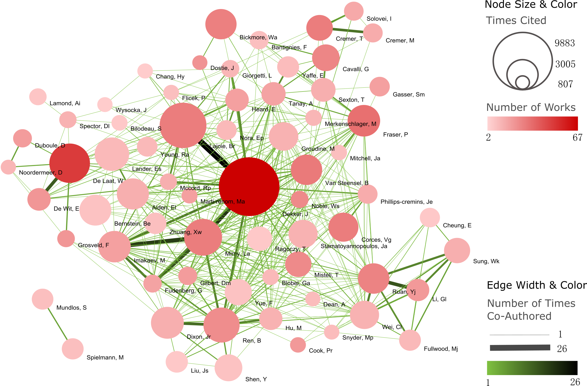
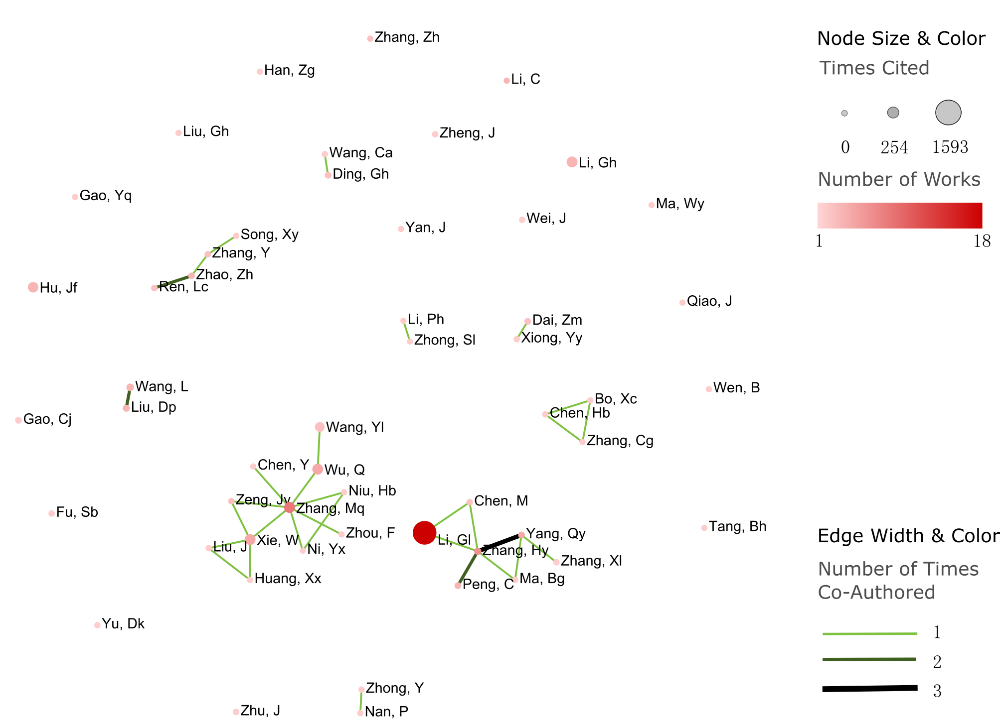

Description
===========
This repository contains data I collected and the co-authored networks I extracted
from publication records when I selected appropriate labs for my postdoctoral training
recently.

Actually, I used a simple data mining algorithm on publication data. I transformed the
problem of searching good labs into searching good corresponding authors, although they
are not exactly the same thing. I expected to use the number of works, total times cited
by others, and collaboration networks to evaluate the impact of a researcher on a specific
field (here is the 3D genome). Fortunately, the publication records downloaded from web
of science contain all these information. So the most important part of my work was to
collect enough relevant records. From the original searched results in web of science,
I checked the title and the abstract one by one, and removed those not relevant to 3D genome.
Finally, I collected near 2000 publication records. And from this pool, I extracted a
weighted network with nodes as corresponding authors and edge weights as the number of times
those authors co-wrote a paper.

Here's the co-authored network of 68 most influential researchers:

The name (abbr.) of each researcher is labeled on the lower right of corresponding circle.
According to the network, the most influential researcher in this area is Job Dekker, the initiator
of chromosome conformation capture (3C). And it's interesting to see this network is highly modularized
and locally centralized.

I also drew the co-authored network of researchers from Chinese mainland:

Compared with the top 68 researchers in the world, we can see most Chinese researchers are working alone,
which severely limits their impact level.

Another important factor I think we should consider is the research funding a PI has. There
are NSF(National Science Foundation)/NIH(National Institutes of Health)/ERC(European Research
Council) records I collected for several PIs under the folder ``Data/research-funding``. Hope
this can help you.

Website and contact information
===============================
I also collected lab websites and contact information of the best researchers according to
my data:

(Ranked by total times cited)

- Job Dekker

  - Organization
      University of Massachusetts Medical School (麻省大学医学院)
  - E-mail
      job.dekker@umassmed.edu
  - Website
      http://my5c.umassmed.edu/welcome/welcome.php
  - Rank
      1

- Wouter de Laat

  - Organization
      Hubrecht Institute
  - E-mail
      w.laat@hubrecht.eu
  - Website
      https://www.hubrecht.eu/onderzoekers/de-laat-group/
  - Rank
      2

- Leonid Mirny

  - Organization
      Massachusetts Institute of Technology (麻省理工学院)
  - E-mail
      leonid@mit.edu
  - Website
      http://mirnylab.mit.edu/
  - Rank
      3

- Bing Ren

  - Organization
      University of California San Diego (加州大学圣地亚哥分校)
  - E-mail
      biren@ucsd.edu
  - Website
      http://renlab.sdsc.edu/renlab_website//
  - Rank
      4

- Eric S. Lander

  - Organization
      Broad Institute
  - E-mail
      lander@broadinstitute.org
  - Website
      https://www.broadinstitute.org/lander-lab
  - Rank
      5

- Jesse Dixon

  - Organization
      Salk Institute for Biological Sciences (索尔克生物科学研究所)
  - E-mail
      jedixon@salk.edu
  - Website
      http://dixon.salk.edu/index.php
  - Rank
      6

- Peter Fraser

  - Organization
      Florida State University (佛罗里达州立大学) / Babraham Institute (剑桥巴布拉汉研究所)
  - E-mail
      pfraser@bio.fsu.edu / peter.fraser@babraham.ac.uk
  - Website
      https://www.babraham.ac.uk/our-research/nuclear-dynamics/peter-fraser
  - Rank
      7

- Erez Lieberman Aiden

  - Organization
      Baylor College of Medicine (贝勒医学院) / Rice University (莱斯大学)
  - E-mail
      theaidenlab@gmail.com / erez@erez.com
  - Website
      https://www.aidenlab.org/
  - Rank
      8

- Bradley E. Bernstein

  - Organization
      Massachusetts General Hospital (马萨诸塞州综合医院)
  - E-mail
      Bernstein.Bradley@mgh.harvard.edu
  - Website
      http://bernstein.mgh.harvard.edu/
  - Rank
      9

- Yijun Ruan

  - Organization
      The Jackson Laboratory (杰克逊实验室)
  - E-mail
      Yijun.ruan@jax.org
  - Website
      https://www.jax.org/research-and-faculty/research-labs/the-ruan-lab
  - Rank
      10

- Bas van Steensel

  - Organization
      Netherlands Cancer Institute (荷兰癌症研究所)
  - E-mail
      b.v.steensel@nki.nl
  - Website
      http://research.nki.nl/vansteensellab/
  - Rank
      11

- Wendy Bickmore

  - Organization
      The university of edinburgh (爱丁堡大学)
  - E-mail
      wendy.bickmore@igmm.ed.ac.uk
  - Website
      https://www.ed.ac.uk/mrc-human-genetics-unit/research/bickmore-group
  - Rank
      12

- Victor Corces

  - Organization
      Emory University (埃默里大学)
  - E-mail
      vcorces@emory.edu
  - Website
      http://www.biology.emory.edu/research/Corces/labmainext.html
  - Rank
      13

- Mark Groudine

  - Organization
      Fred Hutchinson Cancer Research Center (弗雷德·哈钦森癌症研究中心)
  - E-mail
      markg@fhcrc.org
  - Website
      https://sharedresources.fredhutch.org/profile/groudine-mark
  - Rank
      14

- Chia-Lin Wei

  - Organization
      The Jackson Laboratory (杰克逊实验室)
  - E-mail
      Chia-lin.Wei@jax.org
  - Website
      https://www.jax.org/research-and-faculty/faculty/research-scientists/chia-lin-wei
  - Rank
      15

- John Stamatoyannopoulos

  - Organization
      Altius Institute for Biomedical Sciences (Altius生物医学科学研究所) / University of Washington (华盛顿大学)
  - E-mail
      jstam@uw.edu
  - Website
      http://www.stamlab.org/
  - Rank
      16

- Yin Shen

  - Organization
      University of California, San Francisco (加州大学旧金山分校)
  - E-mail
      Yin.Shen@ucsf.edu
  - Website
      http://shenlab.ucsf.edu/
  - Rank
      17

- Giacomo CAVALLI

  - Organization
      IGH (Institute of Human Genetics) (France)
  - E-mail
      None
  - Website
      https://www.igh.cnrs.fr/en/research/departments/genome-dynamics/21-chromatin-and-cell-biology
  - Rank
      18

- Feng Yue

  - Organization
      Penn State School of Medicine (宾夕法尼亚州立大学医学院)
  - E-mail
      fyue@hmc.psu.edu
  - Website
      http://yuelab.org/index.html
  - Rank
      19

- Thomas Cremer

  - Organization
      Ludwig-Maximilians-University of Munich, Germany
  - E-mail
      thomas.cremer@lrz.uni-muenchen.de
  - Website
      http://www.humangenetik.bio.lmu.de/personen/cremer-group/cremer-thomas/index.html
  - Rank
      20

- Tom Misteli

  - Organization
      Center for Cancer Research, NIH
  - E-mail
      mistelit@mail.nih.gov
  - Website
      https://ccr.cancer.gov/Laboratory-of-Receptor-Biology-and-Gene-Expression/tom-misteli
  - Rank
      21

- Wing-Kin Sung

  - Organization
      National University of Singapore (新加坡国立大学)
  - E-mail
      ksung@comp.nus.edu.sg
  - Website
      http://www.comp.nus.edu.sg/~ksung/
  - Rank
      22

- Tobias Ragoczy

  - Organization
      University of Washington (华盛顿大学)
  - E-mail
      None
  - Website
      https://www.researchgate.net/profile/Tobias_Ragoczy
  - Rank
      23

- Thomas SEXTON

  - Organization
      IGBMC (France)
  - E-mail
      thomas.sexton@igbmc.fr
  - Website
      http://www-igbmc.u-strasbg.fr/research/department/2/team/118/
  - Rank
      24

- Amos Tanay

  - Organization
      Weizmann Institute, Israel (魏兹曼科学院，以色列)
  - E-mail
      amos.tanay@weizmann.ac.il
  - Website
      http://compgenomics.weizmann.ac.il/tanay/
  - Rank
      25

- Edith Heard

  - Organization
      The Institut Curie, France
  - E-mail
      Edith.Heard@curie.fr
  - Website
      https://science.institut-curie.org/research/biology-cancer-genetics-and-epigenetics/developmental-biology-and-genetics/team-heard/team-members/
  - Rank
      26

- Elzo de Wit

  - Organization
      Netherlands Cancer Institute (荷兰癌症研究所)
  - E-mail
      e.d.wit@nki.nl
  - Website
      https://www.nki.nl/divisions/gene-regulation/de-wit-e-group/
  - Rank
      27

- Ming Hu

  - Organization
      Case Western Reserve University (西储大学)
  - E-mail
      hum@ccf.org
  - Website
      https://sites.google.com/site/afhuming/
  - Rank
      28

- Guoliang Li

  - Organization
      Huazhong Agricultural University (华中农业大学)
  - E-mail
      guoliang.li@mail.hzau.edu.cn
  - Website
      http://guolianglab.org/index.php
  - Rank
      29

- Jun Liu

  - Organization
      Harvard University (哈佛大学)
  - E-mail
      jliu@stat.harvard.edu
  - Website
      http://sites.fas.harvard.edu/~junliu/
  - Rank
      30

- Xiaowei Zhuang

  - Organization
      Harvard University
  - E-mail
      zhuang@chemistry.harvard.edu
  - Website
      http://zhuang.harvard.edu/
  - Rank
      31

- Melissa J. Fullwood

  - Organization
      National University of Singapore (新加坡国立大学)
  - E-mail
      melissa.fullwood@nus.edu.sg
  - Website
      https://fullwoodlab.com/
  - Rank
      32

- Stefan Mundlos

  - Organization
      Max Planck Institute, Germany
  - E-mail
      mundlos@molgen.mpg.de / stefan.mundlos@charite.de
  - Website
      https://www.molgen.mpg.de/3411339/Stefan-Mundlos
  - Rank
      33

- Richard A. Young

  - Organization
      Massachusetts Institute of Technology (麻省理工学院)
  - E-mail
      young@wi.mit.edu 
  - Website
      http://younglab.wi.mit.edu/
  - Rank
      34

- Susan M. Gasser

  - Organization
      Friedrich Miescher Institute (Switzerland)
  - E-mail
      directors.office@fmi.ch
  - Website
      http://www.fmi.ch/research/groupleader/website/gasserlab/susangasser.php
  - Rank
      35

- Edwin Cheung

  - Organization
      University of Macau (澳门大学)
  - E-mail
      ECheung@umac.mo
  - Website
      https://fhs.umac.mo/staff/academic-staff/edwin-cheung/
  - Rank
      36

- Jennifer Phillips-Cremins

  - Organization
      University of Pennsylvania (宾夕法尼亚大学)
  - E-mail
      jcremins@seas.upenn.edu
  - Website
      http://creminslab.com/
  - Rank
      37

- Irina Solovei 

  - Organization
      Ludwig-Maximilians-University of Munich, Germany
  - E-mail
      irina.solovei@lrz.uni-muenchen.de
  - Website
      http://www.bioimaging.bio.lmu.de/personen/solovei_group/solovei/index.html
  - Rank
      38

- David M. Gilbert

  - Organization
      The Florida State University (佛罗里达州立大学)
  - E-mail
      gilbert@bio.fsu.edu
  - Website
      http://gilbertlab.bio.fsu.edu/
  - Rank
      39

- Denis Duboule

  - Organization
      None
  - E-mail
      Denis.Duboule@unige.ch
  - Website
      https://genev.unige.ch/research/laboratory/Denis-Duboule
  - Rank
      40

- Luca Giorgetti

  - Organization
      Friedrich Miescher Institute for Biomedical Research, FMI
  - E-mail
      luca.giorgetti@fmi.ch
  - Website
      http://www.fmi.ch/research/groupleader/?group=134
  - Rank
      41

- William Stafford Noble

  - Organization
      University of Washington (华盛顿大学)
  - E-mail
      william-noble@uw.edu
  - Website
      https://noble.gs.washington.edu/~wnoble/
  - Rank
      42

- Frank Grosveld

  - Organization
      Erasmus University Medical Center Rotterdam (Erasmus大学鹿特丹医学中心)
  - E-mail
      f.grosveld-at-erasmusmc.nl
  - Website
      https://www.narcis.nl/person/RecordID/PRS1237862/Language/en
  - Rank
      43

- Angus I. Lamond

  - Organization
      School of Life Sciences, University of Dundee, Scotland
  - E-mail
      a.i.lamond@dundee.ac.uk
  - Website
      http://www.lamondlab.com/newwebsite/home.php
  - Rank
      44

- David L. Spector

  - Organization
      Cold Spring Harbor Laboratory
  - E-mail
      spector@cshl.edu
  - Website
      http://spectorlab.labsites.cshl.edu/
  - Rank
      45

- Rachel Patton McCord

  - Organization
      University of Tennessee
  - E-mail
      rmccord@utk.edu
  - Website
      https://rpmlab.wordpress.com/
  - Rank
      46

- Matthias Merkenschlager

  - Organization
      Imperial College London (伦敦皇家学院)
  - E-mail
      matthias.merkenschlager@imperial.ac.uk
  - Website
      http://www.imperial.ac.uk/people/matthias.merkenschlager
  - Rank
      47

- Gerd A. Blobel

  - Organization
      The Children's Hospital of Philadelphia (费城儿童医院) / University of Pennsylvania (宾夕法尼亚大学)
  - E-mail
      BLOBEL@EMAIL.CHOP.EDU
  - Website
      https://www.med.upenn.edu/apps/faculty/index.php/g20001500/p1105
  - Rank
      48

- Marc A. Marti-Renom 

  - Organization
      Catalan Institution for Research and Advanced Studies, Spain
  - E-mail
      martirenom@cnag.crg.eu
  - Website
      http://www.crg.eu/en/marc_marti_renom
  - Rank
      49

- Jennifer Mitchell

  - Organization
      University of Toronto (多伦多大学)
  - E-mail
      ja.mitchell@utoronto.ca
  - Website
      http://labs.csb.utoronto.ca/mitchell/index.html
  - Rank
      50

- Peter R Cook

  - Organization
      University of Oxford (牛津大学)
  - E-mail
      peter.cook@path.ox.ac.uk
  - Website
      http://users.path.ox.ac.uk/~pcook/index.html
  - Rank
      51

- Paul Flicek

  - Organization
      European Bioinformatics Institute, EMI
  - E-mail
      flicek@ebi.ac.uk
  - Website
      https://www.ebi.ac.uk/research/flicek
  - Rank
      52

- Howard Y. Chang

  - Organization
      Stanford University
  - E-mail
      howchang@stanford.edu
  - Website
      http://changlab.stanford.edu/index.html
  - Rank
      53

- Michael Snyder

  - Organization
      Stanford University (斯坦福大学)
  - E-mail
      mpsnyder@stanford.edu
  - Website
      http://snyderlab.stanford.edu/
  - Rank
      54

- Joanna Wysocka

  - Organization
      Stanford University
  - E-mail
      wysocka@stanford.edu
  - Website
      http://stemcellphd.stanford.edu/faculty/joanna-wysocka.html
  - Rank
      55

- Daan Noordermeer

  - Organization
      None
  - E-mail
      daan.noordermeer@i2bc.paris-saclay.fr
  - Website
      http://www.i2bc.paris-saclay.fr/spip.php?rubrique172&lang=en
  - Rank
      56

- Josée Dostie

  - Organization
      McGill University (加拿大麦吉尔大学)
  - E-mail
      josee.dostie@mcgill.ca
  - Website
      https://www.mcgill.ca/biochemistry/about-us/department/faculty-members/dostie
  - Rank
      57

- Ann Dean

  - Organization
      NIH (NIDDK)
  - E-mail
      anndean@helix.nih.gov
  - Website
      https://www.niddk.nih.gov/about-niddk/staff-directory/intramural/ann-dean/pages/research-summary.aspx
  - Rank
      58
