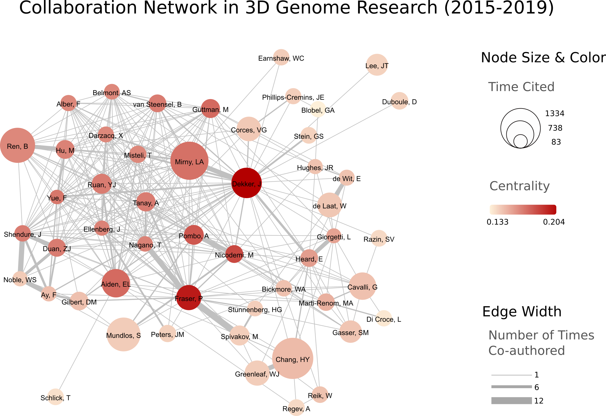

Description
===========
Here's the collaboration network of top 51 labs in 3D Genome between 2015 and 2019:

Website and contact information
===============================
- Job Dekker

  - E-mail
      job.dekker@umassmed.edu
  - Website
      http://my5c.umassmed.edu/welcome/welcome.php

- Peter Fraser

  - E-mail
      pfraser@bio.fsu.edu
  - Website
      https://www.bio.fsu.edu/~fraserlab/

- Ana Pombo

  - E-mail
      Ana.Pombo@mdc-berlin.de
  - Website
      https://pombolab.wordpress.com/

 
- Bing Ren

  - E-mail
      biren@ucsd.edu
  - Website
      http://renlab.sdsc.edu/renlab_website//

- Mario Nicodemi

  - E-mail
      Mario.Nicodemi@na.infn.it
  - Website
      http://people.na.infn.it/~nicodem/

- Tom Misteli

  - E-mail
      mistelit@mail.nih.gov
  - Website
      https://ccr.cancer.gov/Laboratory-of-Receptor-Biology-and-Gene-Expression/tom-misteli

- Erez Lieberman Aiden

  - E-mail
      theaidenlab@gmail.com / erez@erez.com
  - Website
      https://www.aidenlab.org/

- Bas van Steensel

  - E-mail
      b.v.steensel@nki.nl
  - Website
      http://research.nki.nl/vansteensellab/

- Feng Yue

  - E-mail
      fyue@hmc.psu.edu
  - Website
      http://yuelab.org/index.html

- Ming Hu

  - E-mail
      hum@ccf.org
  - Website
      https://sites.google.com/site/afhuming/

- Mitchell Guttman

  - E-mail
      mguttman@caltech.edu
  - Website
      https://www.lncrna-test.caltech.edu/index.php

- Yijun Ruan

  - E-mail
      Yijun.ruan@jax.org
  - Website
      https://www.jax.org/research-and-faculty/research-labs/the-ruan-lab

- Leonid Mirny

  - E-mail
      leonid@mit.edu
  - Website
      http://mirnylab.mit.edu/

- Jan Ellenberg

  - E-mail
      jan.ellenberg@embl.de
  - Website
      https://www-ellenberg.embl.de

- Jay Shendure

  - E-mail
      shendure@uw.edu
  - Website
      https://shendure-web.gs.washington.edu/index.html

- Amos Tanay

  - E-mail
      amos.tanay@weizmann.ac.il
  - Website
      http://compgenomics.weizmann.ac.il/tanay/

- Zhijun Duan

  - E-mail
      zjduan@uw.edu
  - Website
      https://hematology.uw.edu/faculty/zhijun-duan-phd

- Xavier Darzacq

  - E-mail
      darzacq@berkeley.edu
  - Website
      https://www.tjian-darzacq.mcb.berkeley.edu/

- Frank Alber

  - E-mail
      alber@usc.edu
  - Website
      http://web.cmb.usc.edu/people/alber/index.htm

- Andrew Belmont

  - E-mail
      asbel@illinois.edu
  - Website
      https://publish.illinois.edu/belmont-group/

- Ferhat Ay

  - E-mail
      fay@ucsd.edu
  - Website
      https://www.lji.org/faculty-research/labs/ay/#overview

- Edith Heard

  - E-mail
      Edith.Heard@curie.fr
  - Website
      https://science.institut-curie.org/research/biology-cancer-genetics-and-epigenetics/developmental-biology-and-genetics/team-heard/team-members/

- Luca Giorgetti

  - E-mail
      luca.giorgetti@fmi.ch
  - Website
      http://www.fmi.ch/research/groupleader/?group=134

- Marc A. Marti-Renom 

  - E-mail
      martirenom@cnag.crg.eu
  - Website
      http://www.crg.eu/en/marc_marti_renom

- David M. Gilbert

  - E-mail
      gilbert@bio.fsu.edu
  - Website
      http://gilbertlab.bio.fsu.edu/

- Howard Y. Chang

  - E-mail
      howchang@stanford.edu
  - Website
      http://changlab.stanford.edu/index.html

- Giacomo CAVALLI

  - E-mail
      None
  - Website
      https://www.igh.cnrs.fr/en/research/departments/genome-dynamics/21-chromatin-and-cell-biology

- Susan M. Gasser

  - E-mail
      directors.office@fmi.ch
  - Website
      http://www.fmi.ch/research/groupleader/website/gasserlab/susangasser.php

- Wendy Bickmore

  - E-mail
      wendy.bickmore@igmm.ed.ac.uk
  - Website
      https://www.ed.ac.uk/mrc-human-genetics-unit/research/bickmore-group

- Wolf Reik

  - Website
      https://www.babraham.ac.uk/our-research/epigenetics/wolf-reik

- Wouter de Laat

  - E-mail
      w.laat@hubrecht.eu
  - Website
      https://www.hubrecht.eu/onderzoekers/de-laat-group/
      

- Victor Corces

  - E-mail
      vcorces@emory.edu
  - Website
      http://www.biology.emory.edu/research/Corces/labmainext.htm

- Elzo de Wit

  - E-mail
      e.d.wit@nki.nl
  - Website
      https://www.nki.nl/divisions/gene-regulation/de-wit-e-group/

- William Stafford Noble

  - E-mail
      william-noble@uw.edu
  - Website
      https://noble.gs.washington.edu/~wnoble/

- Henk Stunnenberg

  - E-mail
       H.Stunnenberg@ncmls.ru.nl
  - Website
      https://molbio.science.ru.nl/about/molecular-biology/henk-stunnenberg/

- Jim R Hughes

  - E-mail
      jim.hughes@imm.ox.ac.uk
  - Website
      https://www.imm.ox.ac.uk/research/units-and-centres/mrc-molecular-haematology-unit/research-groups/hughes-group-1

- Stefan Mundlos

  - E-mail
      mundlos@molgen.mpg.de / stefan.mundlos@charite.de
  - Website
      https://www.molgen.mpg.de/Development-and-Disease

- Bill Earnshaw

  - E-mail
      bill.earnshaw@ed.ac.uk
  - Website
      http://earnshaw.bio.ed.ac.uk/

- Gary S. Stein

  - E-mail
      Gary.Stein@uvm.edu
  - Website
      https://www.med.uvm.edu/biochemistry/steinlianlab/home

- Mikhail Spivakov

  - E-mail
      mikhail.spivakov/lms.mrc.ac.uk
  - Website
      http://functionalgenecontrol.group

- Jeannie Lee

  - E-mail
      lee@molbio.mgh.harvard.edu
  - Website
      https://molbio.mgh.harvard.edu/laboratories/lee

- Aviv Regev

  - E-mail
      aregev@broadinstitute.org
  - Website
      https://www.broadinstitute.org/regev-lab

- Jennifer Phillips-Cremins

  - E-mail
      jcremins@seas.upenn.edu
  - Website
      http://creminslab.com/

- William J. Greenleaf

  - E-mail
      wjg@stanford.edu
  - Website
      https://greenleaf.stanford.edu/index.html

- Denis Duboule

  - E-mail
      Denis.Duboule@unige.ch
  - Website
      https://genev.unige.ch/research/laboratory/Denis-Duboule

- Jan-Michael Peters

  - E-mail
      jan-michael.peters@imp.ac.at
  - Website
      https://www.imp.ac.at/groups/jan-michael-peters/

- Tamar Schlick

  - E-mail
      schlick@nyu.edu
  - Website
      http://www.biomath.nyu.edu/

- Sergey Razin

  - E-mail
      sergey.v.razin@inbox.ru
  - Website
      http://www.genebiology.ru/en/about-us/staff/razin/

- Luciano Di Croce

  - E-mail
      luciano.dicroce@crg.eu
  - Website
      https://www.crg.eu/en/luciano_di_croce

- Gerd A. Blobel

  - E-mail
      BLOBEL@EMAIL.CHOP.EDU
  - Website
      https://www.med.upenn.edu/apps/faculty/index.php/g20001500/p1105

