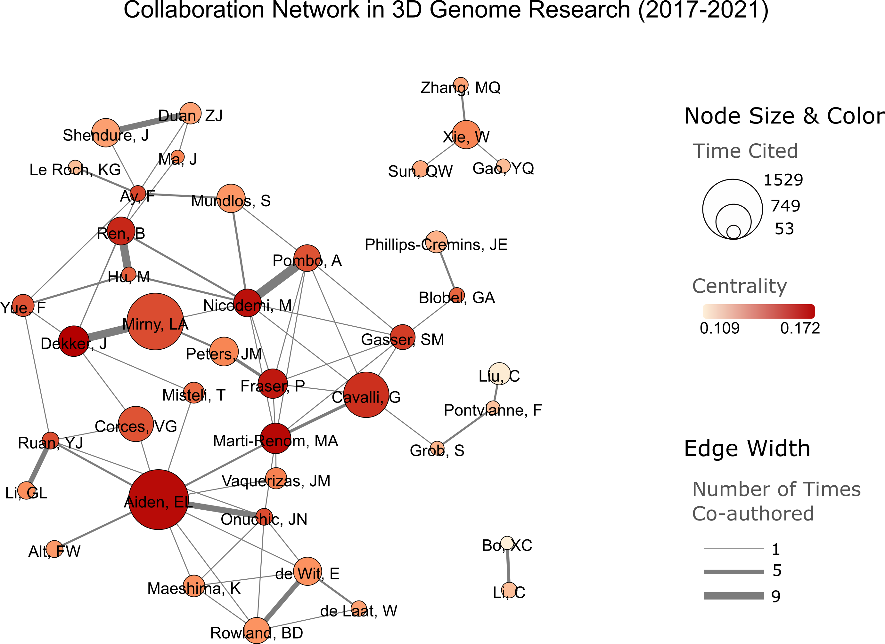

Description
===========
Here's the collaboration network of top 71 labs in 3D Genome from years 2017-2021:

List of labs
============
(Ranked by total times cited)

.. list-table::
   :widths: 25 50 50 50
   :header-rows: 1
   :align: center

   * - Rank
     - Group Leader
     - Total citations as as corresponding author
     - Total publications as corresponding author
   * - 1
     - `Erez Lieberman Aiden <https://www.aidenlab.org/>`_
     - 1529
     - 9
   * - 2
     - `Leonid Mirny <http://mirnylab.mit.edu/>`_
     - 1425
     - 15
   * - 3
     - `Giacomo Cavalli <https://www.igh.cnrs.fr/en/research/departments/genome-dynamics/chromatin-and-cell-biology>`_
     - 1071
     - 12
   * - 4
     - `Victor Corces <http://www.biology.emory.edu/research/Corces/>`_
     - 749
     - 12
   * - 5
     - `Job Dekker <http://www.dekkerlab.org/>`_
     - 601
     - 12
   * - 6
     - `Marc A. Marti-Renom <https://www.crg.eu/marc_marti_renom>`_
     - 599
     - 18
   * - 7
     - `Peter Fraser <https://www.bio.fsu.edu/~fraserlab/>`_
     - 564
     - 7
   * - 8
     - `Jan-Michael Peters <https://www.imp.ac.at/groups/jan-michael-peters/>`_
     - 544
     - 7
   * - 9
     - `Jay Shendure <https://shendure-web.gs.washington.edu/index.html>`_
     - 534
     - 7
   * - 10
     - `Stefan Mundlos <https://www.molgen.mpg.de/Development-and-Disease>`_
     - 533
     - 9
   * - 11
     - `Wei Xie <http://www.xielab.org.cn/>`_
     - 531
     - 8
   * - 12
     - `Elzo de Wit <https://www.nki.nl/research/research-groups/elzo-de-wit/>`_
     - 526
     - 9
   * - 13
     - `Bing Ren <http://renlab.sdsc.edu/renlab_website/>`_
     - 517
     - 10
   * - 14
     - `Mario Nicodemi <http://people.na.infn.it/~nicodem/>`_
     - 511
     - 16
   * - 15
     - `Ana Pombo <https://www.mdc-berlin.de/pombo>`_
     - 477
     - 7
   * - 16
     - `Benjamin Rowland <https://www.nki.nl/research/research-groups/benjamin-rowland/>`_
     - 461
     - 6
   * - 17
     - `Susan Gasser <https://www.fmi.ch/research-groups/website/gasserlab/index.php>`_
     - 423
     - 9
   * - 18
     - `Chang Liu <https://epigenetics.uni-hohenheim.de/en/english>`_
     - 334
     - 9
   * - 19
     - `Feng Yue <http://yuelab.org/>`_
     - 330
     - 7
   * - 20
     - `Jennifer Phillips-Cremins <http://creminslab.com/>`_
     - 328
     - 9
   * - 21
     - `Kazuhiro Maeshima <http://maeshima-lab.sakuraweb.com/>`_
     - 319
     - 9
   * - 22
     - `Zhijun Duan <https://hematology.uw.edu/faculty/zhijun-duan-phd>`_
     - 312
     - 7
   * - 23
     - `Juanma Vaquerizas <https://www.vaquerizaslab.org/>`_
     - 305
     - 8
   * - 24
     - `Tom Misteli <https://ccr.cancer.gov/staff-directory/tom-misteli>`_
     - 296
     - 7
   * - 25
     - `Guoliang Li <http://www.guolianglab.org/subpages/OUR%20TEAM/group%20members.php>`_
     - 187
     - 16
   * - 26
     - `Frederick Alt <https://www.childrenshospital.org/research/labs/alt-laboratory>`_
     - 171
     - 7
   * - 27
     - Yijun Ruan
     - 168
     - 9
   * - 28
     - `Jose Onuchic <https://onuchic.rice.edu/index.html>`_
     - 164
     - 6
   * - 29
     - `Qianwen Sun <http://www.cls.edu.cn/english/PrincipalInvestigator/pi/index2571.shtml>`_
     - 148
     - 6
   * - 30
     - `Ferhat Ay <https://www.lji.org/labs/ay/>`_
     - 132
     - 6
   * - 31
     - `Cheng Li <http://3d-genome.life/>`_
     - 127
     - 9
   * - 32
     - ``_
    
